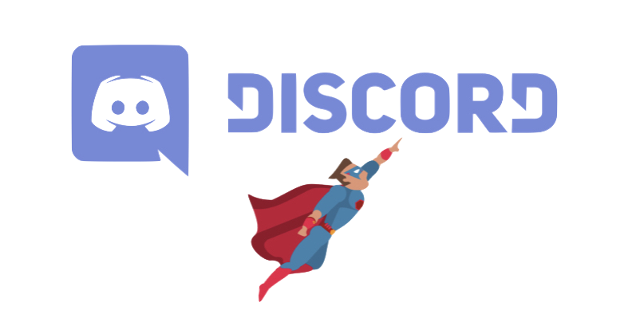
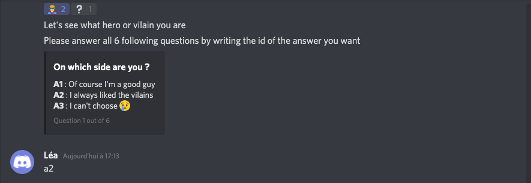
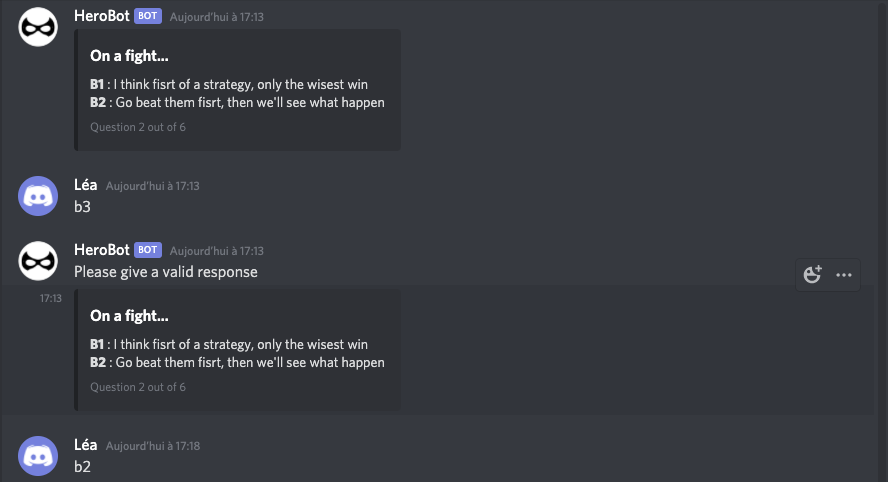
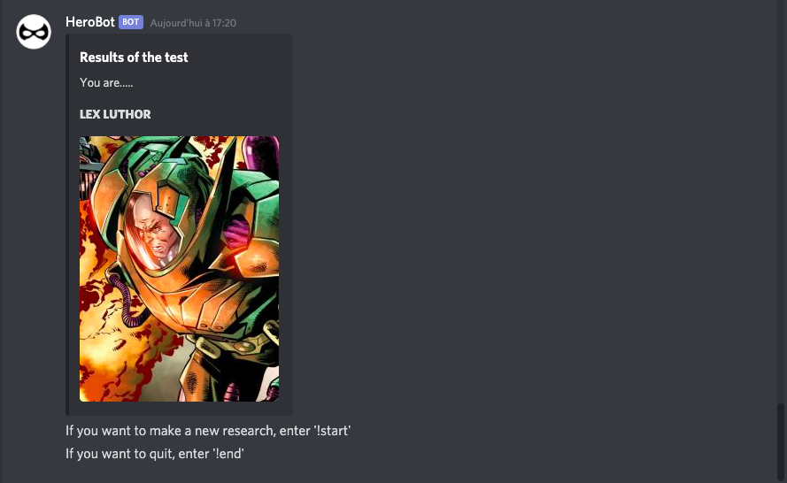
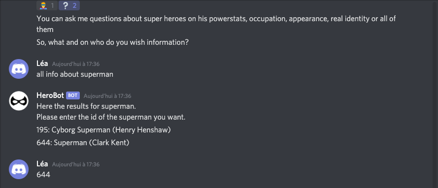
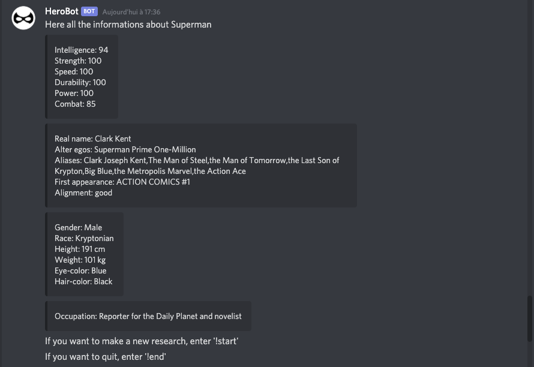
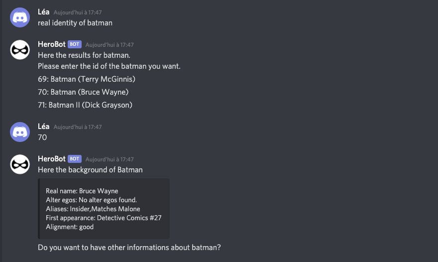
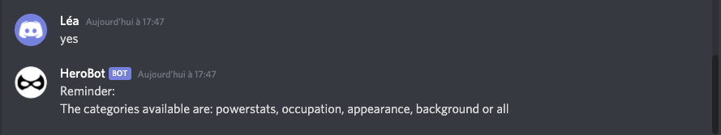
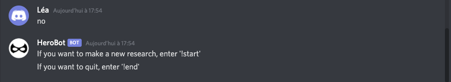

# Discord Hero Chatbot 

> Léa Wong, Simon Hervé



## Introduction

Our Chatbot, HeroBot, was build with Node.js and Discord.js. \
To fetch the data, we used the api [SuperHeroAPI](https://superheroapi.com/).

## Setup

After getting the project files, you need a few things to make it work.
- first, you need to install all the packages. To do so, run the following command in the folder
```
    npm i
``` 
- then, you need two tokens, one for the SuperHeroAPI and the other is for your discord chatbot
> To create a bot on Discord, go to https://discordapp.com/developers/applications and create a new applications. Then you can create a public bot and get a token

Once you have all the token, you can replace them in the files (./api/token.js) for SuperHeroAPI and in (./app.js) at the end, for the bot. \
Congratulation, now you just have to run 
````
node app.js
````

## Use

Now that the server is on, you just have to connect to your discord account and add your new bot in one of your server. 
>To do so just go to the following link by replacing [CLIENT_ID] by the client id of your discord application
https://discordapp.com/oauth2/authorize?client_id=[CLIENT_ID]&scope=bot&permissions=0

You can then use the bot!

### Launch the bot

To launch the bot, tou just have to enter !start. \
This command works all along to get back to the Menu.


### What hero/vilain are you ?

The first part of the bot is a test to determine to whom superhero/vilain you alike. You will have to answer 6 questions by giving the id of the answer.



if you give a bad answer, the bot will ask you an other answer.



After answering the 6 quesions, you will have the result. \
The result can be : Superman, Batman, Aquaman, Wonder Woman, Flash, Raven, Catwoman, Joker, Lex Luthor, Deadshot



### Getting information about you favourite character

The second part of this bot is simply a searching part to get several informations about any superhero or vilain. \
You just have to give the information and the name of the personnage (in this specific order). \
Then, you will have to enter the id of the character, to confirm your choice if there is one result or to choose if several characters have the same name.


I you chose to have all informations, after display all, the bot will suggest either go back to the Menu or to shut down the bot.



Otherwise, if you chose to have only one information, the bot will ask you if you want to have an other information about the same personnage.



If you say yes, the bot remind you all the categories available.



If you say no, you can either go back to the menu or shut down the bot.




